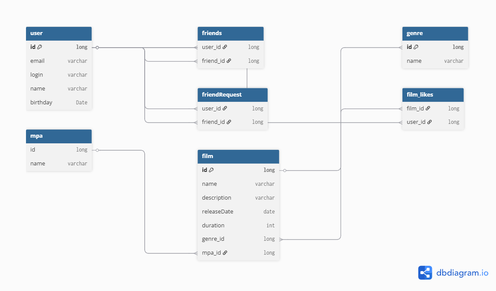

# java-filmorate




**Example requests**
--------------------

### Get all Films

  ```
SELECT *

FROM film
   ```

### Get all users

 ```
SELECT *
   
FROM user
   ```

### Found user by email

 ```
SELECT *
   
FROM user

WHERE email = 'foundUsers@gmail.com'
 ```

### Sort users by birthday

 ```
SELECT *

FROM user

ORDER BY birthday
 ```

### Get all name films with genre

 ```
SELECT f.name,

        g.name

FROM film AS f

INNER JOIN genre AS g ON g.id = f.genre_id
```

### Get all films with MPA sorted by realise date

```
SELECT f.name,

        m.name
        
FROM film AS f

LEFT OUTER JOIN mpa AS m ON f.mpa_id = m.id

ORDER BY f.releaseDate DESC
```

### Get count likes by film

```
SELECT f.name,

        COUNT(fl.user_id) AS like_count
        
FROM film AS f

INNER JOIN film_likes AS fl ON fl.film_id = f.id

GROUP BY f.name
```

### Get all friends by user(where user_id = 1)

```
SELECT *

FROM user AS u

INNER JOIN friends AS f ON f.friend_id = u.id

WHERE f.user_id = 1
```

### Get all request in friends to user(user_id = 1)

```
SELECT *

FROM user AS u

INNER JOIN friendRequest AS fq ON fq.friend_id = u.id

WHERE fq.friend_id = 1
```

### Get all films which like user(user_id =1)

```
SELECT *

FROM film 

WHERE id IN (

SELECT film_id 

FROM film_likes

WHERE user_id = 1)
```

### Get all users who liked film (film_id = 1)

```
SELECT *

FROM user 

WHERE id IN (

SELECT user_id

FROM film_likes 

WHERE film_id =1)
```

### Get films which have more than 2 likes

```
SELECT f.name,
        COUNT(fl.user_id)
        
FROM film AS f

LEFT OUTER JOIN film_likes AS fl ON fl.film_id = f.id

GROUP BY f.name 

HAVING COUNT(fl.user_id) > 2
```

### Get all the users with their number of friends

```
SELECT u.name,
        COUNT(f.user_id)

FROM user AS u

INNER JOIN friends as f ON f.user_id = u.id

GROUP BY u.name
```

### Get top 10 films

```
SELECT *

FROM film AS f

WHERE id IN (

SELECT film_id
        
FROM film_likes

GROUP BY film_id

ORDER BY COUNT(user_id) DESC

LIMIT 10);
```

### Get films with genre without likes

```
SELECT f.name,

        g.name
        
FROM film as f

LEFT OUTER JOIN genre AS g ON g.id = f.genre_id

LEFT OUTER JOIN film_likes AS fl ON fl.film_id = f.id

GROUP BY f.name

HAVING COUNT(fl.user_id) = 0
```

### Get friends by user with count of  films that likes them (user_id = 1)

```
SELECT u.name ,

        COUNT(fl.user_id)
        
FROM user AS u 

LEFT OUTER JOIN friends AS f ON f.friend_id = u.id

LEFT OUTER JOIN film_likes AS fl ON  u.id = fl.user_id 

WHERE f.user_id = 1

GROUP BY u.name
```


